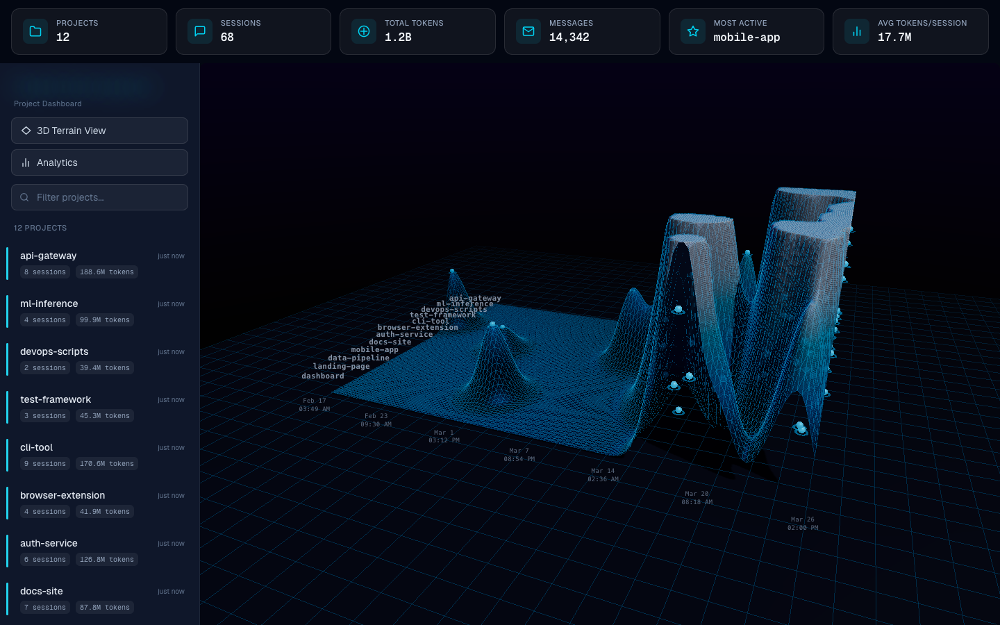
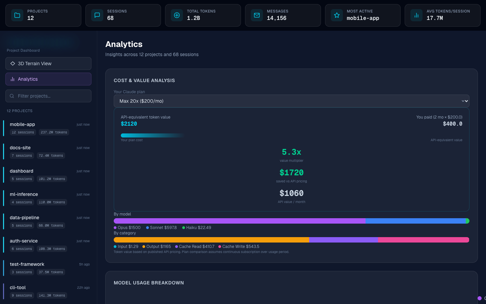

<!-- Banner -->
<p align="center">
  
</p>

<!-- Badge row -->
<p align="center">
  <a href="LICENSE"></a>
  
  
  
  
  <a href="https://github.com/hummusonrails/claude-code-inspector/issues"></a>
</p>

<!-- One-liner + nav -->
<p align="center">
  <strong>A local dashboard that reads your ~/.claude data and visualizes every project, session, token, and dollar.</strong>
  <br>
  <a href="#quick-start">Quick Start</a> · <a href="#usage">Usage</a> · <a href="https://github.com/hummusonrails/claude-code-inspector/issues">Report a Bug</a>
</p>

<br>

<p align="center">
  
</p>

<br>

## What it does

- **Visualize** all your Claude Code projects as an interactive 3D terrain — peaks represent token usage over time
- **Inspect** any session to see first prompt, last prompt, model, message count, and full token breakdown
- **Estimate** your API-equivalent cost and compare it against your actual plan — see exactly how much value your subscription delivers
- **Analyze** usage patterns with 8 analytics sections: cost breakdown, model distribution, daily trends, activity heatmap, context utilization, cache efficiency, session durations, and project rankings
- **Drill down** into any metric with detail modals showing per-project tables, time series, scatter plots, and actionable insights
- **Run locally** — your data never leaves your machine, reads directly from `~/.claude`

## Quick Start

```bash
git clone https://github.com/hummusonrails/claude-code-inspector.git
cd claude-code-inspector
npm install
npm run build
npx next start -p 3001
```

Open [http://localhost:3001](http://localhost:3001) in your browser.

> Requires Node.js 18+ and an existing `~/.claude` directory from Claude Code usage.

## Stack

| Layer | Tool | Notes |
|:------|:-----|:------|
| Framework | Next.js 16 (App Router) | Server-side API routes read `~/.claude` data |
| 3D visualization | Three.js | Terrain mesh, bloom post-processing, raycasted interaction |
| Styling | Tailwind CSS 4 | Dark glassmorphism theme with cyan accents |
| Charts | Pure SVG | No chart library — all visualizations are hand-rolled SVG |
| Language | TypeScript 5 | Strict mode, full type coverage |
| Data | `~/.claude/projects/` | JSONL session files streamed line-by-line |

<details>
<summary><strong>Prerequisites</strong></summary>

- [Node.js 18+](https://nodejs.org)
- [Claude Code CLI](https://docs.anthropic.com/en/docs/claude-code) installed and used at least once (creates `~/.claude`)
- A modern browser with WebGL support (for the 3D terrain)

</details>

## Usage

### 3D terrain view

The default view renders all your projects as a 3D terrain landscape. Each ridge represents a project, and peaks correspond to high token usage sessions. Click any glowing data point to open a detail modal.

- **Orbit** — click and drag to rotate
- **Zoom** — scroll wheel
- **Pan** — right-click drag
- **Click data points** — opens session detail modal with full token breakdown

### Project detail view

Click any project in the sidebar to see:

- Session list with model badges, sparklines, and expandable token breakdowns
- First and last prompts for each session
- "View Full Details" button opens a tabbed modal with overview, prompts, token usage donut chart, and context timeline

### Analytics view

Click "Analytics" in the sidebar. Eight sections, each clickable for drill-down detail:

| Section | What it answers |
|:--------|:----------------|
| Cost & Value Analysis | How much am I spending vs my plan? |
| Model Usage Breakdown | Which models do I use most? |
| Daily Activity Trend | Is my usage growing or shrinking? |
| Context Window Utilization | Am I hitting context limits? |
| Activity Heatmap | When do I code with Claude? |
| Cache Efficiency | How much is caching saving me? |
| Session Duration Distribution | How long are my sessions? |
| Top Projects | Which projects cost the most? |

Select your Claude plan (Pro, Max 5x, Max 20x, Teams, or API) to see your value multiplier — how many dollars of API-equivalent value you get per dollar of subscription.

<details>
<summary><strong>Analytics screenshot</strong></summary>
<br>
<p align="center">
  
</p>
</details>

### Activating Analytics Pro

1. Purchase a license key from the [Claude Code Inspector Pro page](https://hummusonrails.lemonsqueezy.com)
2. Open Claude Code Inspector in your browser
3. Click **Analytics** in the sidebar
4. Click **Already have a key? Click to activate**
5. Paste your license key and click **Activate**

Your key is saved locally and persists across sessions. The 3D terrain view, project inspection, and session modals are always free.

## Project structure

```
src/
├── app/
│   ├── api/
│   │   ├── projects/
│   │   │   ├── route.ts              # list all projects
│   │   │   └── [id]/
│   │   │       ├── route.ts          # project detail
│   │   │       └── sessions/
│   │   │           └── [sessionId]/
│   │   │               └── route.ts  # session detail
│   │   └── stats/
│   │       └── route.ts              # global stats
│   ├── layout.tsx
│   ├── page.tsx                      # main app shell
│   └── globals.css
├── components/
│   ├── ContextModal.tsx              # session detail modal with tabs
│   ├── ProjectDetail.tsx             # project view with expandable sessions
│   ├── Sidebar.tsx                   # project list + view switcher
│   ├── Sparkline.tsx                 # inline SVG sparkline
│   ├── StatsBar.tsx                  # top-level stats row
│   └── TerrainVisualization.tsx      # three.js 3D terrain
└── lib/
    └── claude-data.ts                # reads and parses ~/.claude data
```

## How it reads your data

The app reads directly from `~/.claude/projects/` on your filesystem. Each project directory contains JSONL session files that are streamed line-by-line for efficiency. No data is sent anywhere — everything stays local.

Token pricing estimates use current published API rates:

| Model | Input | Output | Cache read | Cache write |
|:------|:------|:-------|:-----------|:------------|
| Opus 4.6 / 4.5 | $5/MTok | $25/MTok | $0.50/MTok | $6.25/MTok |
| Sonnet 4.6 / 4.5 / 4 | $3/MTok | $15/MTok | $0.30/MTok | $3.75/MTok |
| Haiku 4.5 | $1/MTok | $5/MTok | $0.10/MTok | $1.25/MTok |

## Contributing

Contributions are welcome. Open an [issue](https://github.com/hummusonrails/claude-code-inspector/issues) or submit a PR.

## License

This project is licensed under the [GNU Affero General Public License v3.0](LICENSE). If you deploy this as a service, you must make your source code available to users.
